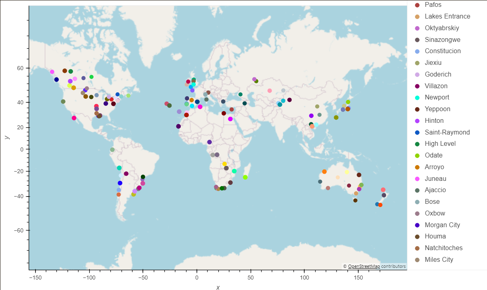
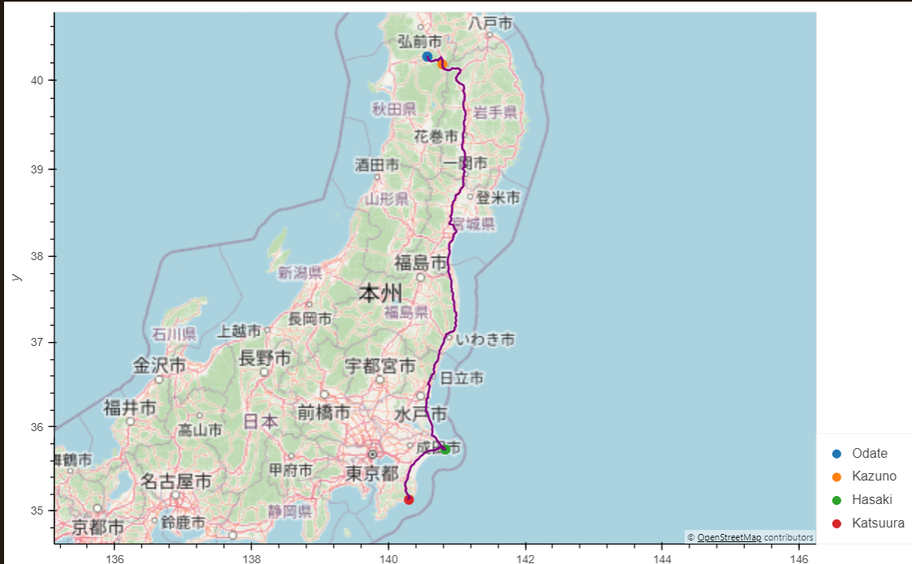

# Plan My Trip

## Project Overview
### Purpose
The objective of this project was to develop an app that leverages APIs to help customers plan vacations based on their weather preferences. This included features for searching suitable destinations and creating a personalized travel itinerary.

### Tools
* OpenWeatherMap API
* Geoampify API
* Python 3.7
* Geoviews
* CitiPy

## Analysis
The project leveraged the OpenWeatherMap API to obtain weather data for a randomly generated list of latitudes and longitudes. Using CitiPy, cities were identified based on their proximity to the given coordinates and a dataframe was subsequently created. User input statements allowed for filtering the dataframe according to maximum and minimum temperature preferences.

The Geoapify API was employed to associate hotels with the filtered locations. Following the selection of four cities, the Geoapify Routing API was utilized to acquire routing information. Finally, the collected data was visualized using GeoViews.
 

## Results
### City Map
Map displaying cities identified from the generated list of latitudes and longitudes with suitable temperatures.

### Travel Itinerary
A map illustrating the travel itinerary for the planned vacation.

